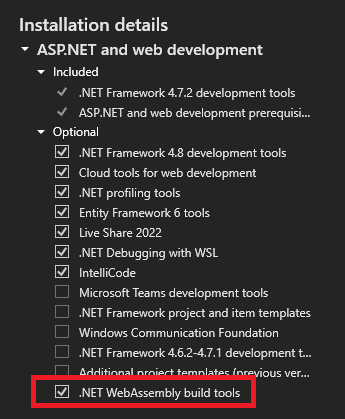

# MyTaskManager
This is a test app using Blazor WASM, using .NET 6, EF Core, and SQLite, to
provide a completely offline ToDo list application.


## How to add SQLite offline support for Blazor WASM

### Install WASM Build tools
Ensure Visual Studio has the ```.NET WebAssembly build tools``` installed. Although this is under optional components, it is required to link native assemblies to the compiled project.  


### Compile SQLite add as a native reference in the project
In the .csproj file add a native file reference to the compiled SQLite file

```xml
...
<PackageReference Include="Microsoft.EntityFrameworkCore.Sqlite" Version="6.0.3" />
<!-- This will output the sqlite library to be included in the browser -->
<NativeFileReference Include="Data\e_sqlite3.o" /> 
...
```
You can copy the binary file ```e_sqlite3.o``` from ```MyTaskManager/Data/e_sqlite3.o``` or compile it yourself. You can also see the whole process adding SQLite in this YouTube video on the dotNET YouTube channel
https://youtu.be/kesUNeBZ1Os?t=302